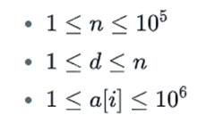
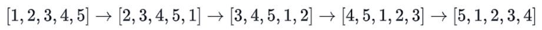

# RotationExcercise

A left rotation operation on an array shifts each of the array's elements 1 unit to the left. For example, if 2 left rotations are performed on array [1, 2, 3, 4, 5] , then the array would become    [3, 4, 5, 1, 2] .
Given an array a of n integers and a number d, perform d left rotations on the array. Return the updated array to be printed as a single line of space-separated integers.

# Function Description
Write down the function rotLeft with any language you like. 
rotLeft has the following parameter(s):
•	An array of integers a.
•	An integer d, the number of rotations.

# Constraints

 

# Explanation
When we perform d = 4 left rotations, the array undergoes the following sequence of changes:
